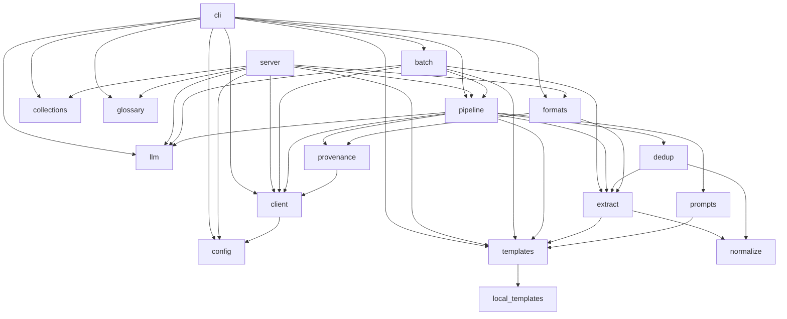
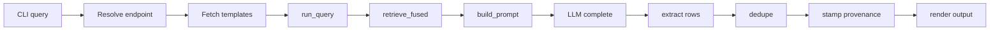
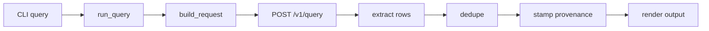
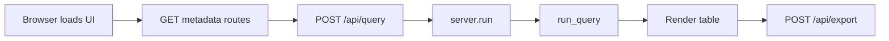

# LitRAG architecture

This document lets a maintainer trace a request from the command line or the browser all the way to the RAGStack API and back, and know which module owns which decision.

## Contents

- [What this document covers](#what-this-document-covers)
- [Tech stack](#tech-stack)
- [Module map](#module-map)
- [Request flows](#request-flows)
- [External systems](#external-systems)
- [HTTP surface of the web server](#http-surface-of-the-web-server)
- [Data model of a row](#data-model-of-a-row)
- [Configuration surfaces](#configuration-surfaces)
- [Test strategy](#test-strategy)
- [Known gaps](#known-gaps)

## What this document covers

This document is for maintainers of LitRAG and for other codeathon teams who need to know how the pieces fit together before changing or reusing one. It covers structure and data flow, not day to day usage: for install and command examples, read `README.md`. For a plain language tour aimed at a non-technical reader, read `WALKTHROUGH.md`.

## Tech stack

- Python: 3.9 or later required, 3.12 pinned for development in `.python-version`.
- Workspace: a uv workspace at the repository root with one member, `litrag/`, and a committed `uv.lock`.
- Build backend: setuptools, declared in `litrag/pyproject.toml`.
- Console script: `litrag = litrag.cli:main`, installed by the package build.
- CLI framework: Typer, used throughout `litrag/litrag/cli.py`.
- Web framework: FastAPI served by uvicorn; request bodies are pydantic models, which FastAPI brings in as a dependency.
- Web UI: plain HTML, CSS and JavaScript in `litrag/litrag/web/`, served as static files with no front end framework.
- HTTP client: httpx, used by both the RAGStack client and the local generator client.
- Batch input: PyYAML, used to parse YAML batch specification files.
- Tests: pytest, run over recorded fixtures rather than a live server.

## Module map

| Module | Responsibility | Used by |
|---|---|---|
| `litrag/litrag/__init__.py` | Package entry point, re-exports the public classes and functions | External importers of the package |
| `litrag/litrag/cli.py` | Typer commands: version, templates, glossary, collections, query, batch, serve | Console script `litrag` |
| `litrag/litrag/server.py` | FastAPI application backing the web UI | `litrag serve`, uvicorn |
| `litrag/litrag/client.py` | Typed httpx wrapper over the read only RAGStack API, with retry and rank fusion | cli, server, batch, pipeline, provenance |
| `litrag/litrag/config.py` | Resolves the API key and base URL from argument, environment, then config file | cli, server |
| `litrag/litrag/collections.py` | Corpus registry: readable names, the all-collections option, title cleanup | cli, server |
| `litrag/litrag/templates.py` | Fetches and resolves data type declarations, server side and local | cli, server, batch, pipeline, prompts |
| `litrag/litrag/local_templates.py` | Data types defined by LitRAG itself, plus a user override file | templates |
| `litrag/litrag/llm.py` | OpenAI compatible generation backends: presets, endpoint resolution, chat completion | cli, server, batch, pipeline |
| `litrag/litrag/prompts.py` | Builds the local generation prompt from a template declaration | pipeline, cli (dry run), server (request preview) |
| `litrag/litrag/pipeline.py` | One curation query end to end: retrieve, generate, extract, dedupe, stamp | cli, server, batch |
| `litrag/litrag/extract.py` | Parses a model answer into rows, resolves citations, flags problems | pipeline, batch, dedup, formats |
| `litrag/litrag/dedup.py` | Merges rows that state the same fact, per template identity rules | pipeline, batch (via merge_runs) |
| `litrag/litrag/normalize.py` | Value normalization used to compute row identity for dedup | extract, dedup |
| `litrag/litrag/provenance.py` | Stamps each row with the settings and request that produced it | pipeline |
| `litrag/litrag/formats.py` | Renders rows as TSV, CSV, JSON, JSONL, Markdown or a plain text table | cli, server |
| `litrag/litrag/glossary.py` | Plain language definitions for columns and row flags | cli, server |
| `litrag/litrag/batch.py` | Runs many queries concurrently from a file, with resume support | cli |

The dependency graph below shows which module imports which. `cli` and `server` sit at the top because nothing imports them; `pipeline` sits in the middle because both surfaces route through it; the remaining modules are leaves that pipeline and its neighbours build on.



## Request flows

### Local generator path

Steps for `litrag query` with the default generator or any `--llm` value other than `server`:

1. `cli.query` resolves the generator with `llm.resolve_endpoint`.
2. `cli._connect` builds a client through `config.load_config` and `client.RagStackClient`.
3. `cli._registry` fetches data types with `templates.TemplateRegistry.fetch`, which also pulls in `local_templates.declarations`.
4. `pipeline.run_query` is called with the resolved endpoint.
5. `pipeline._generate_locally` retrieves chunks through `client.retrieve_fused` (or `client.retrieve` for a non fused mode).
6. `pipeline.plan_output_tokens` sizes the answer, then `prompts.build_prompt` builds the prompt from the template declaration.
7. `llm.LlmClient.complete` sends the chat completion request to the chosen endpoint.
8. `extract.extract` parses the answer into rows and resolves citations.
9. `dedup.dedupe` merges rows that state the same fact, unless `--no-dedupe` was given.
10. `provenance.build` and `provenance.stamp` attach the run's settings to every row.
11. `formats.render` writes the table, and `cli._write` sends it to stdout or a file.



### Hosted path

Steps for `--llm server`, which issues one `POST /v1/query`:

1. `cli.query` resolves the endpoint to `None`, since `server` has no endpoint of its own.
2. `pipeline.run_query` is called with `endpoint=None`.
3. `pipeline.build_request` assembles the request body from the `QuerySpec` and the template.
4. `client.RagStackClient.query` issues the single `POST /v1/query` call, which retrieves and generates server side.
5. `extract.extract` parses the returned answer into rows.
6. `dedup.dedupe` merges duplicate facts, unless disabled.
7. `provenance.build` and `provenance.stamp` attach the run's settings.
8. `formats.render` writes the result.



### Web UI path

Steps for `litrag serve`, from the browser through FastAPI to the shared pipeline:

1. `cli.serve` starts uvicorn against `litrag.server:app`, which mounts the `web/` directory at `/static` and serves `index.html` at `/`.
2. On load, `app.js`'s `loadMetadata` calls `GET /api/templates`, `GET /api/collections`, `GET /api/backends` and `GET /api/glossary` to populate the form.
3. The form submit calls `app.js`'s `search`, which sends `POST /api/query`.
4. `server.run` resolves the endpoint with `server._endpoint`, resolves collections with `server._resolve`, and builds a `QuerySpec` with `server._spec`.
5. `pipeline.run_query` executes exactly as in the local or hosted flow above, depending on the resolved endpoint.
6. `server.run` returns rows, citations, flags and summary as JSON, and `app.js`'s `renderResult` draws the table.
7. A download click calls `app.js`'s `download`, which sends `POST /api/export`; `server.export` reruns `pipeline.run_query` and returns the rendered file through `formats.render`.



## External systems

The RAGStack base URL defaults to `https://www.bv-brc.org/ragstack/hackathon/api`, set in `config.py` as `DEFAULT_BASE_URL`, and can be overridden by argument, environment variable or config file.

| Method | Path | Used for | Called from |
|---|---|---|---|
| GET | `/health` | Liveness check | `client.health` |
| GET | `/v1/version` | Client and server version strings | `client.version` |
| GET | `/v1/prompt-templates` | Fetch data type declarations (read only, `POST` returns 405) | `client.prompt_templates`, `templates.TemplateRegistry.fetch` |
| GET | `/v1/collections` | Fetch the searchable corpora | `client.collections`, `collections.CollectionRegistry.fetch` |
| POST | `/v1/retrieve` | Retrieve ranked source chunks for one query | `client.retrieve`, `client.retrieve_fused` |
| POST | `/v1/query` | Hosted retrieval and generation in a single call | `client.query`, `pipeline.run_query` (hosted branch) |

Generator presets, from `llm.py`:

| Name | Host and port | Model |
|---|---|---|
| qwen (default) | mango.cels.anl.gov:8004 | Qwen/Qwen3.6-35B-A3B |
| llama | mango.cels.anl.gov:8003 | RedHatAI/Llama-4-Scout-17B-16E-Instruct-FP8-dynamic |

Any string passed to `--llm` that contains `://` is accepted as a custom OpenAI compatible endpoint (`llm.resolve_endpoint`), not just the two presets above. When no model id is given for such an endpoint, `llm.LlmClient.resolve_model` calls `GET {base_url}/models` to discover one, which is the standard OpenAI compatible `/v1/models` listing path.

The API key is resolved in this order: an explicit `--api-key` argument, then the `LITRAG_API_KEY` environment variable, then `api_key` in `~/.config/litrag/config.toml`. The same order applies to the base URL, through `--base-url`, `LITRAG_BASE_URL`, and `base_url` in the same file.

## HTTP surface of the web server

| Method | Route | What it returns |
|---|---|---|
| GET | `/api/health` | LitRAG version plus the RAGStack server version |
| GET | `/api/templates` | Data type declarations, with per column help text and local versus server origin |
| GET | `/api/backends` | The generator choices the UI can offer, hosted and local |
| GET | `/api/glossary` | Definitions for the derived columns and row flags |
| GET | `/api/collections` | Searchable corpora, plus the combined all corpora option |
| POST | `/api/request` | The exact request payload a query would send, without sending it |
| POST | `/api/query` | Rows, citations, flags and a summary for one query |
| POST | `/api/export` | The rendered table as a downloadable file in the requested format |
| GET | `/` | `index.html` |

Static files are mounted at `/static`, serving the `litrag/litrag/web/` directory (`index.html`, `app.js`, `style.css`), only when that directory exists on disk.

## Data model of a row

Every extracted fact is a `Row`, defined in `extract.py`, carrying the values a template declared as columns plus everything needed to check and merge that fact.

| Field | Type | Meaning |
|---|---|---|
| `values` | dict of column to text | The cell values keyed by column name, as cleaned from the model's answer |
| `citations` | list of `Citation` | The resolved references backing this row |
| `flags` | list of text | Quality signals, such as `no_citation` or `off_target_gene` |
| `n_support` | integer | How many raw rows merged into this one |
| `query_ids` | list of text | Identities of the queries that produced or merged into this row |
| `provenance` | dict | The stamped record describing what produced the row, from `provenance.build` |
| `variants` | dict of column to list | Disagreeing values kept when rows merge on a non identity column |
| `standard` | dict of column to text | Canonical notation for a value the source wrote in prose |

Each `Citation`, also in `extract.py`, resolves one `[n]` marker to a real paper and to the passages that support it.

| Field | Type | Meaning |
|---|---|---|
| `marker` | integer | The `[n]` position in the retrieved sources list |
| `pmid`, `pmcid`, `doi` | text or none | Identifiers for the paper, when available |
| `journal`, `year`, `title`, `first_author` | text or none | Bibliographic details |
| `resolved` | boolean | Whether the marker matched a real retrieved source |
| `matched_by` | text | `marker` for a `[n]` reference, `author` for a prose name match |
| `chunks` | list of `ChunkRef` | Every retrieved passage that supports this citation, in marker order |

Row flags and where each is set:

| Flag | Set in |
|---|---|
| `no_citation`, `citation_not_in_sources`, `unresolved_citation` | `extract.extract_table`, via `parse_citations` |
| `column_count_mismatch` | `extract.extract_table`, via `_realign_row` |
| `compound_row` | `extract.extract_table`, via `_split_compound` |
| `evidence_free` | `extract.extract_table`, via `_is_evidence_free` |
| `missing:<column>` | `extract.extract_table` |
| `method_not_a_technique` | `extract.extract_table` |
| `reversed_pair` | `extract.extract_table`, via `_names_the_organism` |
| `off_target_gene` | `extract.extract_table`, via `_gene_keys` |
| `merged_variants:<column>` | `dedup.dedupe` |

The annotation columns, added to every exported table by `provenance.py`'s `ANNOTATION_COLUMNS`, describe the extraction itself: `_n_support`, `_flags`, `_citations`, `_pmids`, `_chunk_ids`, `_markers`, `_standard_notation`, `_as_written`.

The provenance columns, from `provenance.py`'s `PROVENANCE_COLUMNS`, describe what produced the row: `_query_id`, `_template`, `_template_version`, `_template_hash`, `_model`, `_collection`, `_top_k`, `_retrieval_mode`, `_retrieved_at`, `_request_id`, `_generator`, `_llm_endpoint`, `_prompt_hash`.

> [!NOTE]
> A column converted from prose to standard notation shows only the canonical form in the table cell. The source's original wording is not discarded, it moves to `_as_written` next to `_standard_notation`.

The JSON export nests citations and their supporting chunks rather than flattening them, consistent with the shape shown in `README.md`:

```json
{
  "Mutation": "S315T",
  "citations": [{
    "pmid": "19578178",
    "journal": "J Antimicrob Chemother",
    "chunks": [
      {"marker": 3, "chunk_id": "e641b7e2", "start_char": 0, "end_char": 2110},
      {"marker": 5, "chunk_id": "f09b6a14", "start_char": 3596, "end_char": 5400}
    ]
  }],
  "chunk_ids": ["e641b7e2", "f09b6a14"]
}
```

## Configuration surfaces

The API key and base URL both resolve in the same order: explicit argument, then environment variable, then the user config file. This is handled once, in `config.load_config`, so the CLI and the web server behave identically.

- `~/.config/litrag/config.toml`: holds `api_key` and `base_url`.
- `~/.config/litrag/templates.toml`: holds `[[templates]]` entries that add local data types, in `local_templates.py`'s `USER_TEMPLATES_PATH`.
- `LITRAG_API_KEY`: environment override for the API key.
- `LITRAG_BASE_URL`: environment override for the base URL.

CLI flags that change behaviour, from `cli.py`, grouped by command:

Query:

| Flag | Effect |
|---|---|
| `--organism`, `-O` | The organism of interest, required |
| `--genes`, `-g` | Comma separated genes or proteins |
| `--other-terms`, `-t` | Extra search terms |
| `--type`, `-T` | Data type to extract |
| `--top-k`, `-k` | Chunks to retrieve, 1 to 100 |
| `--collection`, `-c` | Corpus id, comma separated ids, or all |
| `--format`, `-f` | Output format |
| `--output`, `-o` | Write to a file instead of stdout |
| `--no-provenance` | Omit the provenance columns |
| `--keep-empty` | Keep rows that report nothing, flagged instead of dropped |
| `--no-dedupe` | Do not merge duplicate facts |
| `--retrieval-mode` | fused, hybrid, vector, or bm25 |
| `--show-sources` | Print the retrieved sources |
| `--dry-run` | Print the request body and exit |
| `--llm` | Generator: server, a preset name, or a URL |
| `--llm-model` | Override the model id at that endpoint |
| `--thinking` / `--no-thinking` | Force reasoning mode on a model that supports it |
| `--api-key`, `--base-url` | Configuration overrides |

Batch:

| Flag | Effect |
|---|---|
| `spec_file` | TSV, CSV, JSON, or YAML file of queries |
| `--output`, `-o` | Write the merged table here |
| `--format`, `-f` | Output format |
| `--concurrency`, `-j` | Parallel queries, 1 to 16 |
| `--type`, `-T` | Default data type for rows that omit one |
| `--top-k`, `-k` | Chunks to retrieve per query |
| `--collection`, `-c` | Corpus id, comma separated ids, or all |
| `--resume` | Skip queries already recorded in the progress file |
| `--progress` | Progress sidecar path |
| `--no-provenance`, `--keep-empty`, `--no-dedupe` | Same effect as in query |
| `--llm`, `--llm-model`, `--thinking` / `--no-thinking` | Same effect as in query |
| `--api-key`, `--base-url` | Configuration overrides |

Serve:

| Flag | Effect |
|---|---|
| `--host` | Bind address, default 127.0.0.1 |
| `--port`, `-p` | Bind port, default 8080 |
| `--api-key`, `--base-url` | Configuration overrides, exported to the server process's environment |

## Test strategy

`tests/conftest.py` defines a `load` helper that reads a JSON file from `tests/fixtures/` and three session scoped fixtures built on it: `registry`, built from `templates.json`'s declarations through `TemplateRegistry.from_declarations`; `mutation_response`, from `mutation_katg.json`; and `ppi_response`, from `ppi_sars_cov2.json`. Each fixture pins something a live query actually returned, so a test failure means a real behaviour regressed rather than a synthetic case breaking.

Individual test modules that need a live seeming server build their own `httpx.MockTransport` handlers, seen in `test_batch.py`, `test_pipeline.py`, `test_server.py`, `test_llm.py` and `test_ast.py`. Between the recorded fixtures and the mocked transports, the suite makes no real network call.

Run the suite from the repository root with `uv run pytest`, or, once `uv sync` has built the workspace virtual environment at the repository root, with `.venv/bin/python -m pytest` from inside `litrag/`.

## Known gaps

Not tested:

- No load or concurrency testing exists against `litrag serve`, so its behaviour under many simultaneous browser sessions is unknown.
- `client.py` does implement retry and backoff (up to four attempts, exponential backoff, on HTTP 429, 500, 502, 503 and 504), but no test exercises that retry path.
- Batch concurrency (`--concurrency`, `-j`) is not exercised above small values in the test suite, so behaviour at the upper bound of 16 is unverified.

Tested and found negative, per the deployment notes in `README.md`:

- The RAGStack server does not accept new templates: `POST /v1/prompt-templates` returns HTTP 405.
- The `llm` field on the hosted `/v1/query` is inert: passing it returns HTTP 200 with an empty answer and no sources.
- Only read only endpoints are used by design. Ingest, collection management, grading, and admin endpoints exist on the server but are deliberately out of scope for this client.

A reader cannot conclude from this document alone that the untested paths above are safe at scale, only that they have not yet been exercised by the test suite.
