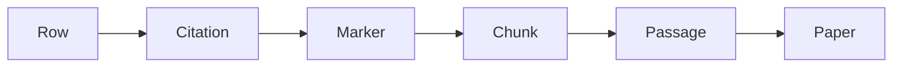

# LitRAG walkthrough

A curated table is a set of claims about an organism, backed one by one by the exact passage that supports each claim. You can check any claim in it, and none of this needs an installation.

## Contents

- [What this is](#what-this-is)
- [Why it exists](#why-it-exists)
- [A guided example](#a-guided-example)
- [What the columns mean](#what-the-columns-mean)
- [What the flags mean](#what-the-flags-mean)
- [What the tool refuses to do](#what-the-tool-refuses-to-do)
- [Auditing a claim](#auditing-a-claim)
- [What it is not for](#what-it-is-not-for)
- [Where to read next](#where-to-read-next)

## What this is

You ask a question with three parts: an organism, a list of genes, and a kind of finding, such as a mutation, a protein interaction, or a drug resistance result. The tool searches the literature for you and answers with a table. Every row in that table is a single claim, and every claim carries the exact passage, paper, and citation it came from. Nothing in the table is asserted without a passage you can go back and read.

## Why it exists

Hand curation of the literature does not scale. There is too much of it, and reading every paper on a topic by hand takes longer than any curator has. A model can read fast, but a model's answer on its own is not something you can check: you cannot tell whether it read the paper correctly or made the claim up. This tool exists to close that gap. It keeps the passage behind every claim, so speed and checkability do not trade off against each other.

## A guided example

### The question

A curator wants to know what isoniazid resistance mutations have been reported in two tuberculosis genes, katG and inhA. In the tool's terms, that question has three parts:

- Organism: Mycobacterium tuberculosis
- Genes: katG, inhA
- Finding type: mutation, with the extra search term isoniazid resistance

### The sources it found

The run reports "8 sources to 7 rows". A source here is a retrieved passage, not a whole paper. Several passages can come from the same paper, and each one is read and counted separately, since one paper can state more than one relevant fact across different sections. Eight passages went in, and the model's answer was cleaned down to seven rows before anything was shown.

### The table it produced

```
Organism                    Gene Name  Mutation                Phenotype                      n
--------------------------  ---------  ----------------------  -----------------------------  --
Mycobacterium tuberculosis  katG       Ser315Thr (S315T)       INH resistance (moderate...)   10
Mycobacterium tuberculosis  katG       Deletion                INH resistance (very high...)   3
Mycobacterium tuberculosis  katG       Ser315Asn (S315N)       INH resistance                  1
Mycobacterium tuberculosis  inhA       c-15t                   INH resistance (low level...)   4
Mycobacterium tuberculosis  inhA       Ser94Ala                INH resistance (moderate...)    1
```

Two rows read like this in plain words:

- Row one says that a change at position 315 of the katG gene, from serine to threonine, was mentioned ten times across the passages the tool read, and it comes with moderate resistance to isoniazid.
- Row four says that a change at position 15 of the promoter region ahead of inhA, from C to T, has been reported four times, and it comes with a lower level of resistance than the katG change. The minus sign before 15 marks it as a promoter position, and the tool keeps that sign meaningful rather than treating `c-15t` and `c15t` as the same thing.

The README that ships with the tool says plainly that exact output varies between runs, since the underlying models are nondeterministic. The same question run twice will not always produce byte-identical tables, though the same facts should keep showing up.

### The n = 10 collapse

The passages the tool read did not all spell that katG change the same way. Some wrote `S315T`, some wrote `Ser315Thr`, some wrote `katG-S315T`, some wrote `Ser315→Thr`, and some wrote `Ser315Thr (S315T)`. The tool recognized that all ten spellings name the same underlying change and collapsed them into the single row shown above, backed by seven distinct papers. The nearby mutation `Ser315Asn`, which is a genuinely different change at the same position, stayed in its own separate row rather than being folded in.

> [!NOTE]
> The number 10 counts merged mentions, not papers. The row is backed by seven distinct papers, so ten mentions are fewer than ten sources.

## What the columns mean

The web page shows a definition on hover for every column that has one. The rows below cover the columns from the example above, then the underscore-prefixed columns a curator sees once a table is downloaded, glossed from the project README.

| Column | In plain words |
|---|---|
| Organism | The organism the finding is about, as named in the source. |
| Gene Name | The gene or protein the finding concerns. A row can name a gene outside the ones you asked for. Those rows are kept and marked `off_target_gene`, since the finding is still real. |
| Mutation | The sequence change, shown as the source wrote it. Different spellings of the same change, such as `Ser315Thr`, `S315T`, and `katG-S315T`, are recognized as one fact behind the scenes. |
| Phenotype | The observable effect attributed to the finding. |
| Assertion | Where the claim stands in its source. See the table below for the five allowed values. |
| Reference | The citation marker the model wrote in its answer. Resolved to a real paper in the Citations information; a marker that matches no retrieved source is flagged rather than guessed at. |
| n | How many mentions across retrieved passages merged into this row. A higher number means the same fact was stated more than once. Check the citations to see whether that is several papers or one paper mentioned more than once. |
| `_n_support` | The download version of the n column above: how many extracted mentions merged into this row. |
| `_flags` | The quality signals attached to this row. Each one is explained in the flags table below. |
| `_citations` | The papers backing this row, each one linked to PubMed or a DOI. |
| `_pmids` | The PubMed identifiers of the papers behind this row, one for each citation. |
| `_chunk_ids` | The identifiers of the exact passages the row's claim was read from. Each one can be used to pull the original passage text back. |
| `_as_written` | The mutation exactly as the source paper wrote it, before any conversion. |
| `_standard_notation` | The mutation converted to a standard form, such as `G53D`. This converted form is also what the tool uses to recognize that two differently written mentions are the same fact. |

### The Assertion vocabulary

On a local generator, the Assertion column is limited to five values. This axis says where a claim stands in its source, not how confident the model feels about it. Whether a source measured something or only relayed someone else's claim is something you can check against its text; a model's own confidence is not.

| Value | Meaning |
|---|---|
| measured | The source ran the experiment that shows this. |
| inferred | The source concludes it indirectly from its own data. |
| predicted | Computational or in silico only. |
| reported | The source attributes it to other work, not its own. |
| disputed | The source contradicts it, or fails to confirm it. |

## What the flags mean

A flag is a quality signal attached to a row. The same wording appears on hover over a flag chip in the web page.

| Flag | In plain words | What to do with it |
|---|---|---|
| `off_target_gene` | The row is about a gene outside the ones you asked for. It was kept rather than dropped, because the finding is still real, it just was not the gene you searched for. | Trust the finding, but notice it answers a different gene than the one you asked about. |
| `citation_not_in_sources` | The reference names a paper that is not among the retrieved sources. Usually the model picked the name out of a chunk's own bibliography rather than a paper it actually read. | Check the citation by hand before relying on it. |
| `no_citation` | The source gave no reference for this row at all. | Check the row against the original paper before treating it as supported. |
| `unresolved_citation` | The citation marker points past the end of the retrieved source list, so it could not be matched to any paper. | Check it by hand. The tool could not resolve where this claim came from. |
| `merged_variants:<column>` | Rows that merged into this one disagreed on the named column. Every value is listed in the cell, so one paper's wording is never presented as every source's finding. | Check the listed alternatives. Pick the value that matters for your purpose rather than trusting only the shown one. |
| `column_count_mismatch` | The source row did not have one value per column, so the alignment shown is a reconstruction rather than a plain reading. | Check by hand. Values could be shifted by one column. |
| `compound_row` | The source packed more than one finding into a single row, and they could not be split apart without guessing. | Check by hand, and read the original passage directly. |
| `missing:<column>` | A column the row cannot be read without is empty, either the one carrying the finding itself, or one naming what the finding is about. | Treat the row as incomplete. It is usually dropped unless empty rows were kept on purpose. |
| `evidence_free` | The row names a subject but reports no finding about it, essentially the question read back as if it were an answer. | Discard it. This row carries no finding. |

## What the tool refuses to do

- Never infers a minimum inhibitory concentration value from a susceptibility call, or the reverse, and applies no breakpoint of its own: a derived value like that would be fabricated data rather than something the source actually reported.
- Never guesses a genome accession or a BioSample identifier: these are recorded only when the source states them explicitly, since guessing one from the organism or strain name would put a fabricated identifier in the table.
- Never rewrites a glycosylation site number: numbering differs between isoforms, strains, and constructs, so renumbering could quietly merge two genuinely different sites into one.
- Never infers the glycosylation linkage type from the residue alone: a linkage read off the residue would be a guess dressed up as a source's own statement, and an empty cell needs to mean the source did not say, not that the tool decided for it.
- Never reorders a host-virus relation: the direction is part of the claim itself, so swapping which protein acts on which would misstate what was actually found.
- Never picks one value when merged papers disagree: every value is listed and the row is flagged, because merging must not present one paper's qualifier as every source's finding.
- Never keeps a row that only restates the question with no finding in it: a row with nothing outside its subject columns is not a finding, it is the question read back.
- Never guesses a citation it cannot match to a retrieved source: it flags the row instead, since an unverified guess would misattribute a claim, and in practice this catches the model citing a paper it only saw in another paper's bibliography.

## Auditing a claim

The path from a row back to its evidence is fixed, from the table to the original text.

1. Start at the row's reference number, the citation marker the model wrote next to the claim.
2. That marker resolves to a citation: a real paper, expanded to its PMID, DOI, journal, year, and first author.
3. The citation carries one or more paragraph markers, one for each passage that supports the claim. A paper cited through two different passages shows two markers.
4. Each paragraph marker points to a chunk, an identifier for one retrieved passage. The passage text itself can always be pulled back using that chunk identifier.

In the web page, the reference number inside a claim is a clickable link. That link scrolls straight to the highlighted passage that supports the claim, so the whole path is one click rather than a lookup.



## What it is not for

- Not a substitute for reading the paper before you act on a claim. The table points you to the passage; it does not replace your own read of what that passage means.
- Not a completeness guarantee. The table reports what it retrieved, and a deeper search of the literature can always find more than a shallower one did.
- Not a confidence score. The Assertion column says where a claim stands in its source, not how sure the model is.
- Not a knowledge graph. That backend is turned off in this deployment and plays no part in building the table.
- Not a way to add papers to the literature it searches. It only reads what is already indexed; it cannot ingest a new paper for you.

## Where to read next

- [README](README.md): what the tool does, how to set it up, every data type, and every output column and flag in full.
- [Architecture](ARCHITECTURE.md): how the package is put together, for anyone who wants to work on it.
